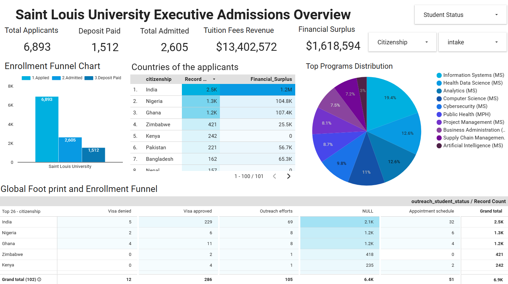

# Unified Admissions Intelligence Pipeline & Dashboard

## 📌 Project Overview
This project was developed during a remote Data Visualization Associate Internship. The objective was to solve a core data fragmentation issue by integrating multiple disparate admissions datasets into a single, reliable data warehouse. 

The resulting data models power an executive-level Looker Studio dashboard designed to track the complete student lifecycle—from initial application and deposit assignment to immigration compliance and enrollment yield.

## 🛠️ Tech Stack
* **Programming & EDA:** Python (Pandas, Matplotlib/Seaborn)
* **Database & ETL:** PostgreSQL, SQL
* **Data Visualization:** Looker Studio
* **Documentation:** Microsoft Word / PDF

## 🧑‍💻 My Contributions & Leadership
This project was a collaborative effort. I took on a dual role as a lead technical developer and the central project coordinator, ensuring seamless integration across the team's workflows.

**Project Management & Coordination**
* **Cross-Cultural Leadership:** Facilitated collaboration among team members from diverse backgrounds by scheduling and leading weekly meetings[cite: 1]. 
* **Workflow Management:** Relayed and delegated weekly tasks, guided the development of the final presentation outline, and facilitated the final live presentation[cite: 3, 7].
* **Synthesis:** Acted as the final editor, compiling diverse analytical workflows and insights from all teammates into a unified, coherent final document[cite: 5].

**Data Engineering & Quality Assurance**
* **Data Integration:** Cleaned, formatted, and joined disparate raw files to architect the unified Master Dataset[cite: 3].
* **SQL Validation:** Developed and verified complex SQL queries to validate dashboard metrics, ensuring complete accuracy between the raw sources and final outputs[cite: 5].
* **Data Governance:** Generated the initial Data Dictionary and Data Quality Report, documenting variables, data types, missing values, and outliers[cite: 1, 2].

**Exploratory Data Analysis (EDA) & Visualization**
* **Python EDA:** Utilized Python to generate initial visualizations (histograms, boxplots, heatmaps) to identify early distributions, patterns, and correlations[cite: 1, 2].
* **Dashboard Architecture:** Collaborated on the Looker Studio dashboard design, defining high-level KPIs, filtering logic, and color themes to support stakeholder decision-making[cite: 3, 4].
* **Insight Generation:** Drafted the Insight Summary Report, clarifying data column mappings and translating visual anomalies into actionable, data-backed conclusions[cite: 5, 6].

## 🔒 Data Privacy & Architecture Notes
* **Raw Data Withheld:** Due to strict data privacy (PII) constraints regarding applicant data, the raw datasets are intentionally excluded from this public repository. 
* **Static Dashboard Connection:** Due to infrastructure constraints during the development phase, the Looker Studio dashboard is connected to a static data export generated by the SQL pipeline. The SQL scripts provided in this repository demonstrate the extraction and transformation logic used to generate that final dataset.

## 📂 Repository Structure
* `/sql_scripts`
  * `ETL_Pipeline.sql` 
  * `Dashboards_Validation_Queries.sql` 
* `/documentation`
  * `Data_Quality_Report.pdf`
  * `Final_Report.pdf` 
* `/Images`
  * `Dashboard.png` 

## 📊 Dashboard Preview

